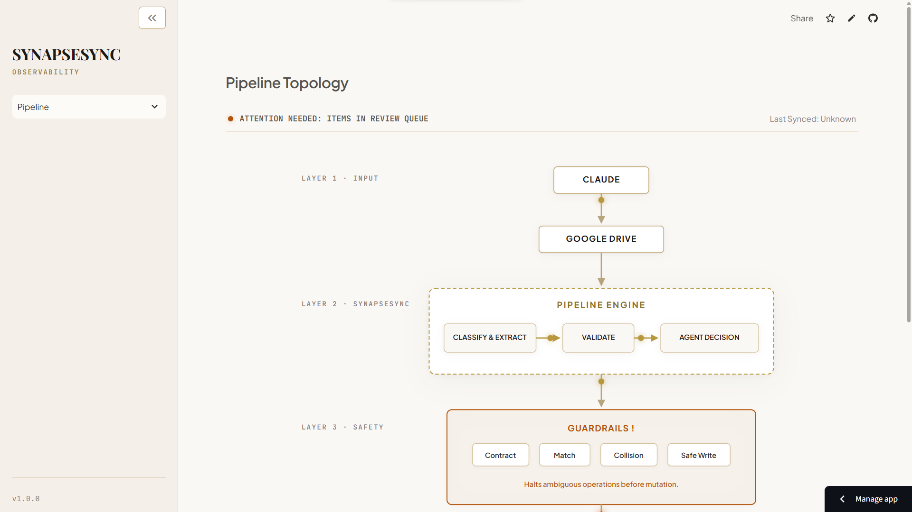

# SynapseSync

An agentic ETL and observability pipeline that turns Claude problem-solving sessions into structured Notion records—automatically.

**Python · Gemini · Notion API · Google Drive API · GitHub Actions**

SynapseSync watches exported Claude transcripts, classifies DSA/SQL sessions, extracts structured problem-solving data, validates proposed changes, and safely synchronizes them into the appropriate Notion tracker.

> **Status:** Actively logging daily. Currently in early usage (a handful of transcripts processed so far) — metrics and a Results section will be added.



## Overview

SynapseSync solves the friction of personal knowledge management for technical interview preparation. When practicing Data Structures & Algorithms (DSA) or SQL, sessions with **Claude.ai** produce standardized summary blocks (`<Problem> — Notion Notes`). SynapseSync automates the transition from raw text export to a structured Notion database via a scheduled GitHub Actions background job.

---

## The Problem & The Approach

### The Problem

My problem-solving workflow had three disconnected steps:

1. Solve with Claude
2. Export conversation
3. Manually update Notion

The manual step meant useful information from tutoring sessions could easily become unstructured or never get recorded.

### The Approach

SynapseSync turns that workflow into an automated pipeline:

```text
Claude → Google Drive → SynapseSync → Classify → Extract → Validate → Decide → Guardrails → Notion
```

---

## Architecture

```text
┌──────────┐
│ Claude   │
│ AI Tutor │
└────┬─────┘
     │ Markdown export
     ▼
┌──────────────┐
│ Google Drive │
└──────┬───────┘
       │
       ▼
┌──────────────────────────────────┐
│          SynapseSync             │
│                                  │
│  Ingest → Classify → Extract     │
│                ↓                 │
│             Validate             │
│                ↓                 │
│          Agent Decision          │
│                ↓                 │
│           Guardrails             │
└────────────────┬─────────────────┘
                 │
          ┌──────┴──────┐
          ▼             ▼
       DSA Notion    SQL Notion
```

* **Ingestion**: Drive API fetches exported Markdown files from a synchronized cloud folder using an OAuth 2.0 refresh token flow.

* **Classification**: Validates file headers and extracts domain context (DSA vs. SQL).

* **Extraction**: Strips conversational UI noise, splits multi-problem transcripts, and parses fields using deterministic regex with Google Gemini fallback.

* **Agent Decision Loop**: Resolves database targets dynamically and enforces strict collision guardrails.

* **Notion Mutation**: Writes structured records safely via updated API contracts.

---

## Engineering Decisions

| **Problem**                    | **Decision**                     | **Why**                                                                      |
| ------------------------------ | -------------------------------- | ---------------------------------------------------------------------------- |
| **DSA vs. SQL classification** | LLM + Signature Check            | Transcripts are stored in one mixed Drive folder without naming assumptions. |
| **Structured extraction**      | Regex first, Gemini fallback     | Reduce unnecessary LLM calls while handling malformed blocks.                |
| **Contract validation**        | Python Dataclasses               | Deterministic correctness before touching external APIs.                     |
| **Duplicate detection**        | Fuzzy matching + collision guard | Handle title naming variations safely across different sessions.             |
| **Idempotency**                | SHA-256 manifest                 | Prevent repeated processing of identical file states.                        |
| **Scheduling**                 | GitHub Actions                   | Simple batch automation without dedicated daemon infrastructure.             |
| **Notion routing**             | Dynamic topic discovery          | Avoid hardcoded DSA database structures.                                     |

---

## Guardrails & Failure Handling

SynapseSync does not blindly execute an LLM-generated operation. Before any Notion mutation occurs, payloads must traverse a strict validation stack:

```text
LLM proposal
     ↓
Contract validation
     ↓
Target lookup
     ↓
Duplicate / collision checks
     ↓
Operation allowlist
     │
     ├──────────────────────┐
     ▼                      ▼
┌──────────────────┐   ┌──────────────────┐
│   SAFE TO WRITE  │   │   NEEDS REVIEW   │
└────────┬─────────┘   └────────┬─────────┘
         │                      │
         ▼                      ▼
   Notion mutation       Human intervention
                          via dashboard
```

* Strict revision-field allowlists to protect canonical problem titles and first-solve notes.
* Duplicate first-solve detection to prevent accidental row duplication.
* Sequel collision protection, such as preventing *"Reverse Linked List"* from matching *"Reverse Linked List II"*.
* Bidirectional fuzzy title matching and word-level candidate search.
* Ambiguous routing flagged automatically to `needs_review`.
* SHA-256 idempotency tracking via `manifest.json`.

---

## Example Flow

When a transcript enters the pipeline:

1. **Detected as DSA** or **SQL** via metadata signatures.
2. **Extracted structured record** using parser/fallback layers.
3. **Topic database discovered** dynamically via Notion hierarchy crawling.
4. **Existing problem searched** using normalized bidirectional matching.
5. **First Solve / Revision** determined based on database state.
6. **Guardrails evaluated** against collision rules.
7. **Notion updated** using appropriate creation or revision payload models.
8. **SHA-256 state recorded** in `manifest.json`.

### First Solve

Creates a new structured Notion record.

### Revision

Updates only permitted revision fields:

```text
Revision Date
2nd Revision Needed
Notes
```

The original solution fields remain untouched.

---

## Observability & Review Dashboard

SynapseSync includes a read-only Streamlit observability dashboard designed to expose pipeline health without exposing personal problem-solving content.

* Pipeline operational status and runtime counters.
* Review queue interface for inspecting guardrail-flagged operations.
* Custom SVG architecture visualization.
* Sanitized operational metadata without exposing solutions, code, queries, or personal study history.


---

## What Broke During Development

### Notion API Migration

The Notion API version required adapting the database mutation layer from legacy identifiers to modern `data_source_id` relationships.

### False Duplicate

*"Reverse Linked List"* was initially matched against *"Reverse Linked List II"*.

A sequel-token collision guard was introduced to resolve this.

### SQL Title Mismatch

Transcripts referenced problems like *"Parts Assembly — Unfinished Parts"* while trackers contained *"Unfinished Parts"*.

Bidirectional fuzzy matching and word-level search solved this.

These failures were discovered during manual production-like verification and resulted in deterministic safeguards rather than increasingly permissive matching.

---

## Testing

* **Unit tests**: Covering extraction, regex parsing, classification, search, and schema contracts.
* **Integration tests**: Verifying agent decision loops and review queue triggers.
* **Dry-run verification**: Safe simulation mode excluding live external API modifications.
* **Dashboard tests**: Covering manifest loading, pagination, DSA topic discovery, SQL normalization, and review-state handling.

---

## Repository Structure

```text
SynapseSync/
├── .github/
│   └── workflows/              # CI and scheduled cron execution configurations
├── dashboard/                  # Streamlit observability web application
│   ├── views/                  # Pipeline and review views
│   ├── app.py                  # Dashboard entry point
│   ├── loader.py               # Read-only data access layer
│   └── style.css               # Dashboard styling
├── src/
│   ├── agent/                  # Decision engine, routing, and guardrails
│   ├── drive/                  # Google Drive OAuth client and ingestion
│   ├── extraction/             # Cleaner, parser, fallback, and schema validation
│   └── notion_tools/           # Discovery, search, mutations, and API helpers
├── tests/                      # Automated unit and integration test suite
├── manifest.json               # State database tracking processed hashes and statuses
├── requirements.txt            # Python runtime dependencies
└── pyproject.toml              # Project configuration and optional dependencies
```

---

## Setup

```bash
git clone https://github.com/your-username/SynapseSync.git
cd SynapseSync

python -m venv venv

# macOS / Linux
source venv/bin/activate

# Windows
# venv\Scripts\activate

pip install -r requirements.txt
```

Copy `.env.example` to `.env` and configure the required credentials for Gemini, Notion, and Google Drive.

Required environment variables:

```text
GEMINI_API_KEY
NOTION_TOKEN
NOTION_DSA_PARENT_PAGE_ID
NOTION_SQL_DB_ID
GOOGLE_DRIVE_FOLDER_ID
GOOGLE_OAUTH_CLIENT_ID
GOOGLE_OAUTH_CLIENT_SECRET
GOOGLE_OAUTH_REFRESH_TOKEN
```

### Run the Dashboard

```bash
python -m streamlit run dashboard/app.py
```

---

## Limitations

* Relies on scheduled GitHub Actions triggers rather than real-time file-system events.
* Requires adherence to Claude's standardized export block format for optimal deterministic parsing.
* External API availability and rate limits can affect processing.
* The dashboard is read-only and does not provide manual Notion mutation controls.

---

## Future Improvements

* Webhook-based instant file trigger support for Google Drive.
* Expanded observability metrics for pipeline performance and failure patterns.
* More robust transcript-format adaptation beyond the standardized Notion Notes block.

---